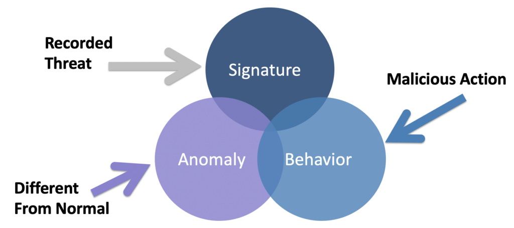
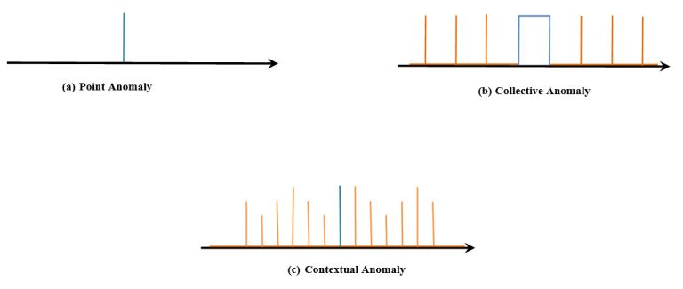
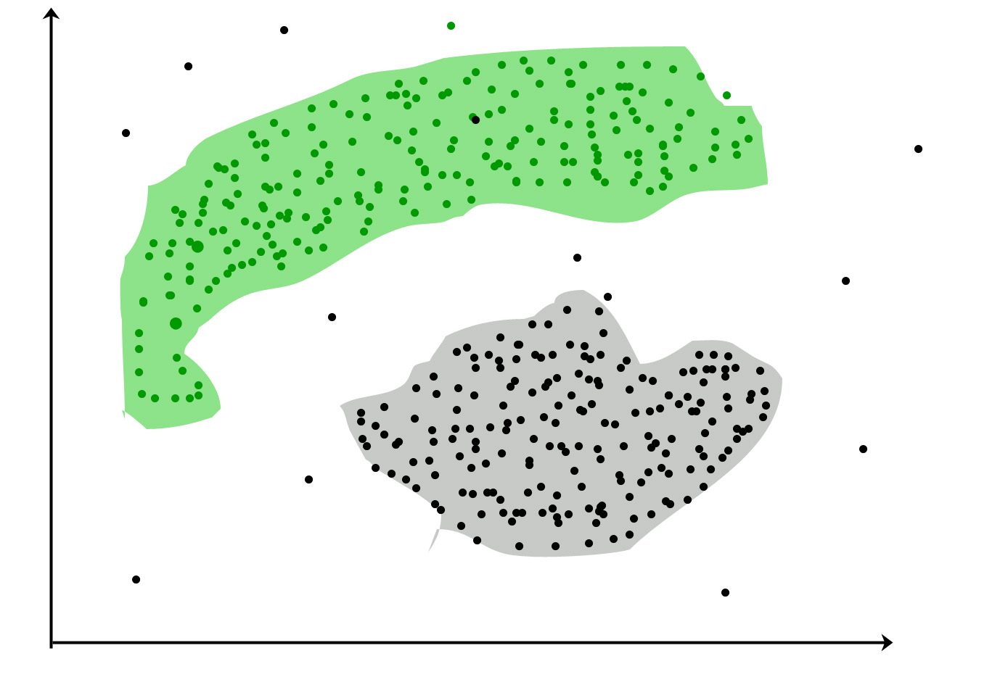

# Context

It is becoming difficult to identify Cybersecurity attacks. These attacks can originate internally due to malicious intent or negligent actions or externally by malware, target attacks, and APT (Advanced Persistent Threats).

But insider threats are more challenging and can cause more damage than external threats because they have already entered the network. 

These activities present unknown threats and can steal, destroy or alter the assets.

# Context

Earlier firewalls, web gateways, and some other intrusion prevention tools are enough to be secure, but now hackers and cyber attackers can bypass approximately all these defense systems. 

Therefore with making these prevention systems strong, it is also equally essential to use detection. So that if hackers get into the network, the system should be able to detect their presence.

# Context

# Context

**Signature detection** requires knowing what to look for and comparing hashes or other strings to identify a match. Signature detection is a common feature found within antivirus and IPS/IDS products. 

**Behavior detection** looks for malicious or other known behavior characteristics and alarms the SOC when a match is made. An example is identifying port scanning or a file attempting to encrypt your hard drive, which is an indication of ransomware behavior. Antimalware and sandboxes are examples of tools that heavily leverage behavior detection capabilities.

**Anomay detection** it takes into consideration hot topics including big data, threat intelligence, and “zero-day” detection.

# Anomaly Detection

Anomaly detection, also called outlier detection, is the identification of unexpected events, observations, or items that differ significantly from the norm:

- Anomalies in data occur only very rarely
- The features of data anomalies are significantly different from those of normal instances

# What is an anomaly?

Generally speaking, an **anomaly** is something that differs from a norm: a deviation, an exception. In software engineering, by anomaly we understand a rare occurrence or event that doesn’t fit into the pattern, and, therefore, seems suspicious. Some examples are:

- sudden burst or decrease in activity;
- error in the text logs;
- sudden rapid drop or increase in temperature.

# What is an anomaly?

Common reasons for outliers are:

- data preprocessing errors;
- noise;
- fraud;
- attacks.

# Types of Anomalies

Anomalies can be broadly categorized as:

- Point anomalies: A single instance of data is anomalous if it's too far off from the rest. 

- Contextual anomalies: The abnormality is context specific. This type of anomaly is common in time-series data.

- Collective anomalies: A set of data instances collectively helps in detecting anomalies.

# Types of Anomalies 

# Anomaly Detection - Example #1

**Network anomalies:** Anomalies in network behavior deviate from what is normal, standard, or expected. To detect network anomalies, network owners must have a concept of expected or normal behavior. Detection of anomalies in network behavior demands the continuous monitoring of a network for unexpected trends or events.

# Anomaly Detection - Example #2

**Application performance anomalies:** These are simply anomalies detected by end-to-end application performance monitoring. These systems observe application function, collecting data on all problems, including supporting infrastructure and app dependencies. When anomalies are detected, rate limiting is triggered and admins are notified about the source of the issue with the problematic data.

# Anomaly Detection - Example #3

**Web application security anomalies:** These include any other anomalous or suspicious web application behavior that might impact security such as CSS attacks or DDOS attacks.

# Anomaly Detection

# Clustering

Type of **unsupervised learning method**. 
Generally, it is used as a process to find meaningful structure, explanatory underlying processes, generative features, and groupings inherent in a set of examples.

# Clustering Methods

- **Density-Based Methods:** These methods consider the clusters as the dense region having some similarities and differences from the lower dense region of the space. These methods have good accuracy and the ability to merge two clusters.

- **Hierarchical Based Methods:** The clusters formed in this method form a tree-type structure based on the hierarchy. New clusters are formed using the previously formed one.

- **Partitioning Methods:** These methods partition the objects into $k$ clusters and each partition forms one cluster. This method is used to optimize an objective criterion similarity function such as when the distance is a major parameter.

# Clustering: Anomaly Detection

# Blind Source Separation

Blind Source Separation (BSS) refers to a problem where both the sources and the mixing methodology are unknown, only mixture signals are available for further separation process.

In several situations it is desirable to recover all individual sources from the mixed signal, or at least to segregate a particular source.

# Blind Source Separation: PCA

** Principal component analysis**, or PCA, is a statistical procedure that allows you to summarize the information content in large data tables by means of a smaller set of “summary indices” that can be more easily visualized and analyzed.

# Blind Source Separation: ICA

**Independent Component Analysis** (ICA) is a powerful technique in the field of data analysis that allows you to separate and identify the underlying independent sources in a multivariate data set.

